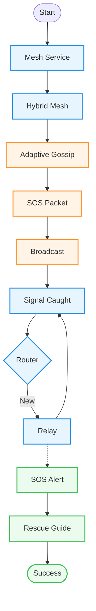

# DisasterSOS: Narrow Vertical Flowchart

### Layout Note:
This flowchart is optimized for **narrow vertical spaces**. It stacks every step on top of the other to keep the width to a minimum while showing the clear progression from launch to rescue.
